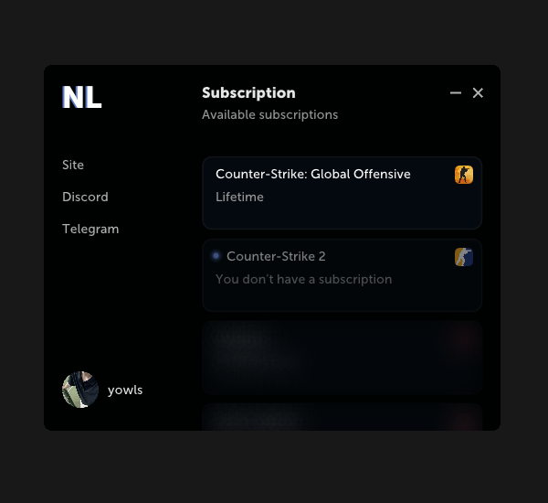
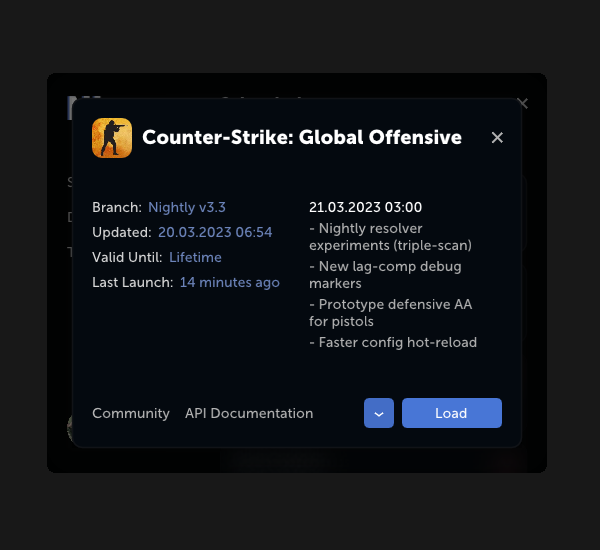

# Neverlose Loader

**Верстка лоадера neverlose.cc по референсам. Win32, D3D11, Dear ImGui, C++20.**

**A recreation of the neverlose.cc loader UI from references. Win32, D3D11, Dear ImGui, C++20.**

[](https://isocpp.org/)
[](https://learn.microsoft.com/windows/win32/direct3d11/)
[](https://github.com/ocornut/imgui)
[](https://cmake.org/)
[](https://github.com/doctest/doctest)
[](LICENSE)

[Русский](#русский) · [English](#english) · [Showcase](#showcase)

> [!NOTE]
> Независимый учебный/исследовательский UI-проект. Не связан с neverlose.cc, не одобрен и не спонсируется им.
>
> Independent learning / research UI project. Not affiliated with, endorsed by, or sponsored by neverlose.cc.

## Showcase

| Dashboard | Modal |
| --- | --- |
|  |  |

---

## Русский

### Особенности

- Информация о подписке парсится из json. Проверка идет в реальном времени: если сабка истекает при открытом модальном окне, оно закрывается само, а контейнер блокируется.
- Приоритет у активных подписок — неактивный контейнер плавно уезжает вниз, когда у другого продукта сабка активная. Переходы везде анимированы.
- Выбор билда.
- Норм блюр.
- Ровные отступы, красивые анимации.
- Ядро (парсинг, персистенция, форматирование, скролл/анимации) отвязано от Win32 и покрыто юнит-тестами, которые собираются и гоняются на любой ОС.

### Сборка

Visual Studio 2022, Windows 10 SDK, CMake 3.23+, x64.

```powershell
cmake --preset default
cmake --build --preset release
```

`build\Release\NL.exe`. Для отладочной — `--preset debug`.

Шрифт по умолчанию — **Inter** (OFL) из `vendor/fonts/inter/` → `src/FontsFree.cpp`. Замена: свои TTF туда же, затем `python tools/gen_fonts.py`.

Museo Sans в репо нет (коммерческий). Локально: gitignored `src/Fonts.cpp` с `MUSEO_SANS_CYRL_*`, сборка с `-DNL_USE_MUSEO=ON`.

Кросс-компиляция NL.exe из Linux/macOS: mingw-w64 toolchain file, `-DNL_BUILD_TESTS=OFF`.

### Тесты

Логика тестируется без Windows — на macOS/Linux достаточно любого компилятора с C++20:

```powershell
cmake --preset tests
cmake --build --preset tests
ctest --preset tests
```

На Windows тесты собираются вместе с приложением (`ctest --preset default` после сборки). CI (`.github/workflows/ci.yml`) гоняет сборку MSVC + тесты на Windows, тесты на Linux и проверку clang-format.

### Структура

```
src/
  main.cpp     DPI, точка входа
  App.*        окно, устройство, кадр
  AppWindow.*  HWND, WndProc, drag, скругление
  AppDevice.*  D3D11, swapchain, Present
  AppFrame.*   анимации, ImGui, отрисовка
  Cheats.*     JSON-подписки + сохранение
  Paths.*      каталог данных пользователя
  Format.h     форматирование дат/статусов
  ui/          дашборд, модалка, тема, скролл
  gfx/         блюр
tests/         юнит тесты
vendor/        imgui, nlohmann/json, stb, doctest, fonts/inter
tools/         генераторы шейдеров, ресурсов и шрифтов
```

`cheats.jaon` сохраняется в `%LOCALAPPDATA%\NLLoader\cheats.json`.

### Лицензия

[MIT](LICENSE). Шрифты и сторонние компоненты — [NOTICE](NOTICE).

---

## English

### Features

- Subscription info is parsed from json. Checks run in real time: if a subscription expires while the modal is open, it closes itself and the container locks.
- Active subscriptions take priority — an inactive container slides down when another product has an active one. Every transition is animated.
- Build selection.
- Proper blur.
- Even padding, smooth animations.
- Core (parsing, persistence, formatting, scroll/animation math) is separate from Win32; unit tests build on any OS.

### Build

Visual Studio 2022, Windows 10 SDK, CMake 3.23+, x64.

```powershell
cmake --preset default
cmake --build --preset release
```

`build\Release\NL.exe`. Use `--preset debug` for a debug build.

Default UI font is **Inter** (OFL) from `vendor/fonts/inter/` → `src/FontsFree.cpp`. To swap: drop TTFs there, run `python tools/gen_fonts.py`.

Museo Sans is not in the repo (commercial). Local opt-in: gitignored `src/Fonts.cpp` with `MUSEO_SANS_CYRL_*`, build with `-DNL_USE_MUSEO=ON`.

Cross-compile NL.exe from Linux/macOS with a mingw-w64 toolchain file and `-DNL_BUILD_TESTS=OFF`.

### Tests

The logic is testable without Windows — any C++20 compiler on macOS/Linux will do:

```powershell
cmake --preset tests
cmake --build --preset tests
ctest --preset tests
```

On Windows the tests build alongside the app (`ctest --preset default` after building). CI (`.github/workflows/ci.yml`) runs the MSVC build + tests on Windows, the tests on Linux, and a clang-format check.

### Structure

```
src/
  main.cpp     DPI, entry point
  App.*        window, device, frame
  AppWindow.*  HWND, WndProc, drag, rounded corners
  AppDevice.*  D3D11, swapchain, Present
  AppFrame.*   animations, ImGui, drawing
  Cheats.*     JSON subscriptions + persistence
  Paths.*      per-user data directory
  Format.h     date/status formatting
  ui/          dashboard, modal, theme, scroll
  gfx/         blur
tests/         unit tests
vendor/        imgui, nlohmann/json, stb, doctest, fonts/inter
tools/         shader, asset, and font generators
```

`cheats.jaon` saving in `%LOCALAPPDATA%\NLLoader\cheats.json`.

### License

[MIT](LICENSE). Fonts and third-party notices: [NOTICE](NOTICE).
